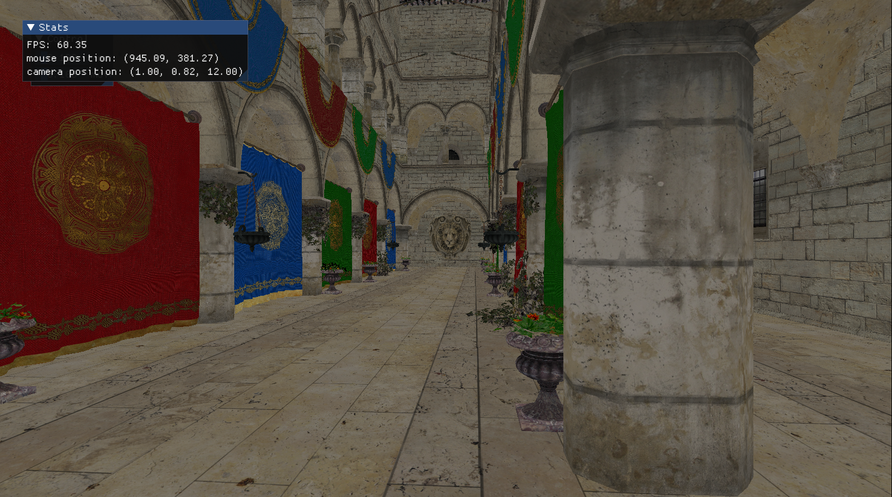

# Chroma


Realtime rendering playground with Vulkan (ash-rs)

## Compile shader
```bash
cargo run --manifest-path crates/chroma-shader/Cargo.toml
```

## Run rendering!
```bash
cargo run --manifest-path crates/chroma-render/Cargo.toml --example render
```

## Control
- Right click: hide cursor and lock
- W/S: Forward/Back
- A/D: Left/Right
- E/Q: Up/Down
- Esc: quit
